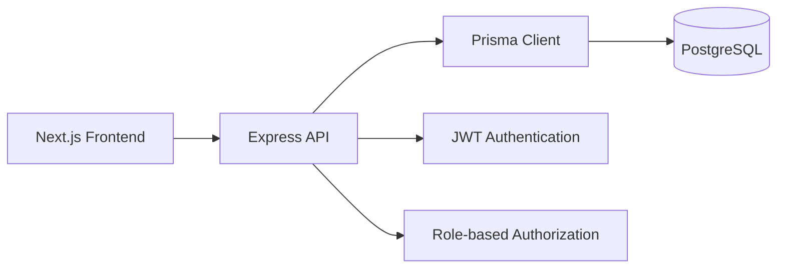

# System Architecture

The frontend renders the user-facing dashboard and login entry points. The API exposes REST endpoints for authentication, dashboards, projects, and tasks. Prisma connects the API to PostgreSQL.
