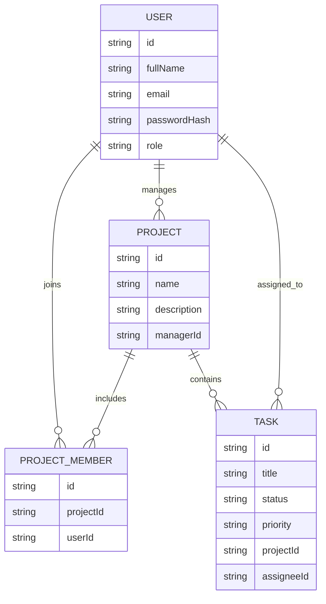

# ERD

```mermaid
erDiagram
  USER ||--o{ PROJECT : manages
  USER ||--o{ PROJECT_MEMBER : joins
  PROJECT ||--o{ PROJECT_MEMBER : includes
  PROJECT ||--o{ TASK : contains
  USER ||--o{ TASK : assigned_to

  USER {
    string id
    string fullName
    string email
    string passwordHash
    string role
  }

  PROJECT {
    string id
    string name
    string description
    string managerId
  }

  PROJECT_MEMBER {
    string id
    string projectId
    string userId
  }

  TASK {
    string id
    string title
    string status
    string priority
    string projectId
    string assigneeId
  }
```

This ERD matches the Prisma schema in the API package.
