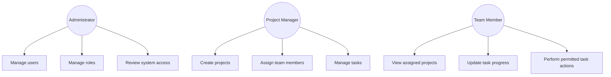

# Use Case Diagram

```mermaid
flowchart TB
  Admin((Administrator)) --> A1[Manage users]
  Admin --> A2[Manage roles]
  Admin --> A3[Review system access]

  PM((Project Manager)) --> P1[Create projects]
  PM --> P2[Assign team members]
  PM --> P3[Manage tasks]

  Member((Team Member)) --> T1[View assigned projects]
  Member --> T2[Update task progress]
  Member --> T3[Perform permitted task actions]
```
